# Architecture Diagrams

This document provides visual architecture diagrams for Jack The Butler using Mermaid notation.

---

## C4 Context Diagram

The system context showing Jack's position in the broader ecosystem:

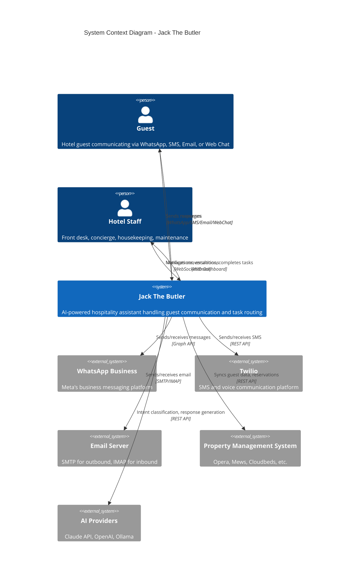

---

## C4 Container Diagram

The main containers/components within Jack:

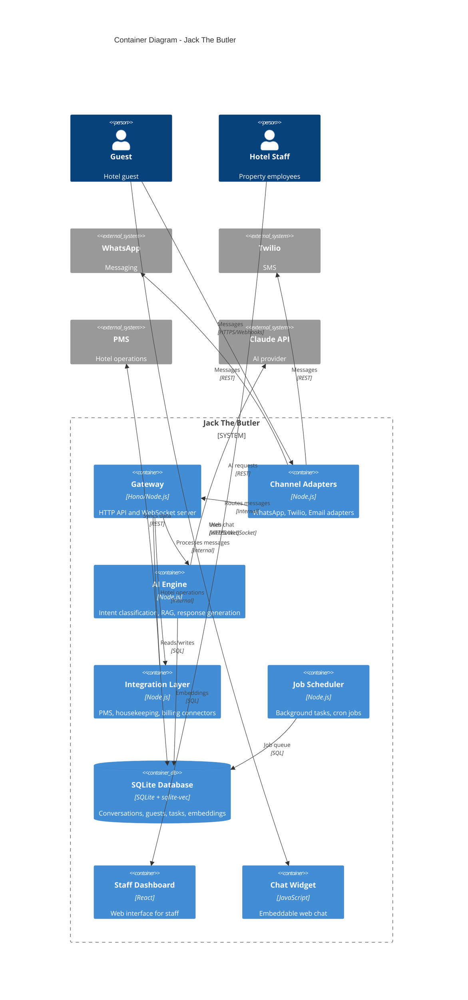

---

## Component Diagram - Gateway

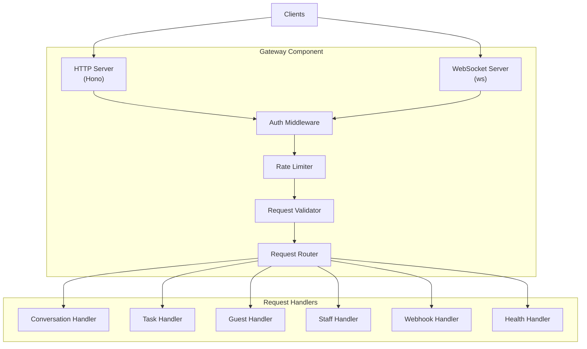

---

## Component Diagram - AI Engine

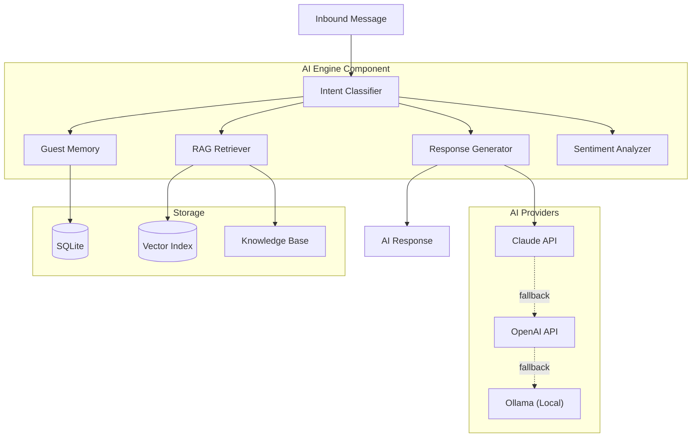

---

## Component Diagram - Channel Adapters

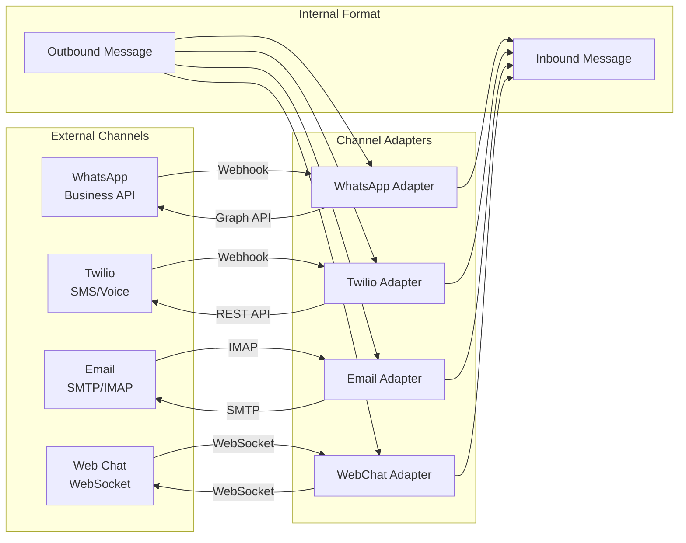

---

## Sequence Diagram - Message Processing

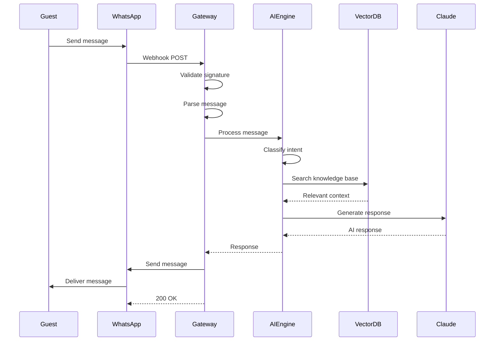

---

## Sequence Diagram - Escalation Flow

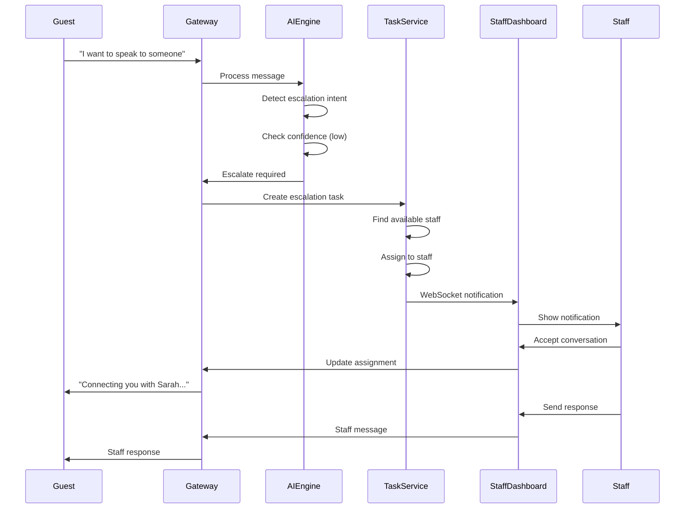

---

## Sequence Diagram - PMS Sync

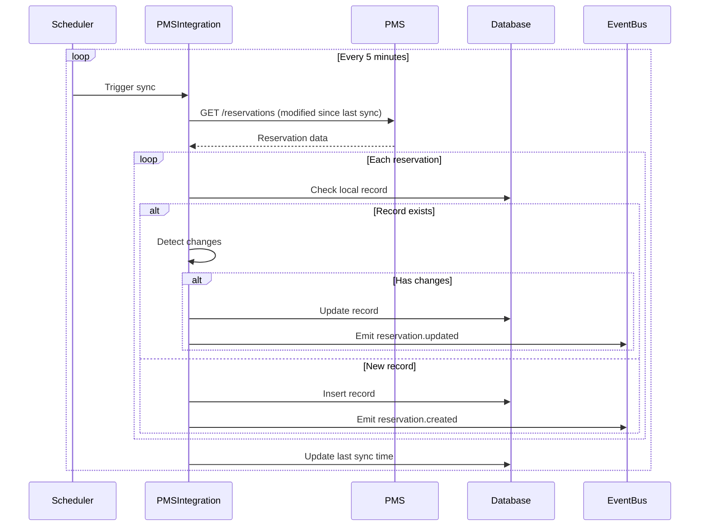

---

## State Diagram - Conversation

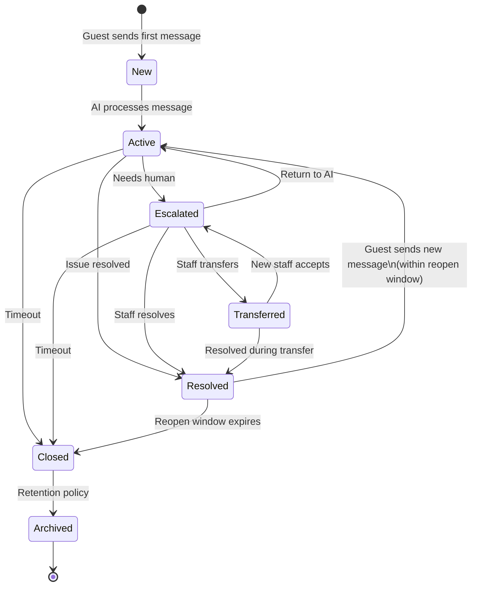

---

## State Diagram - Task

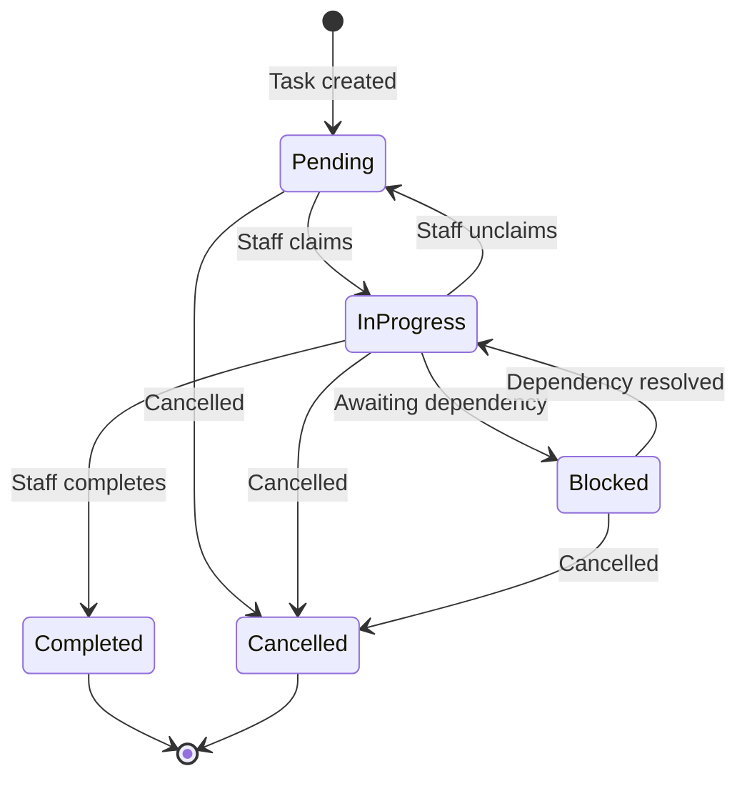

---

## Deployment Diagram

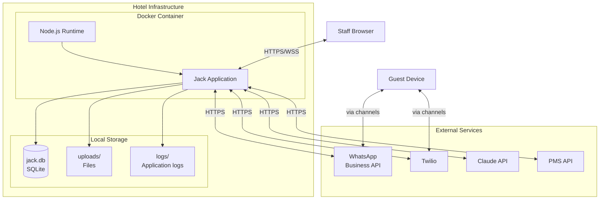

---

## Data Flow Diagram

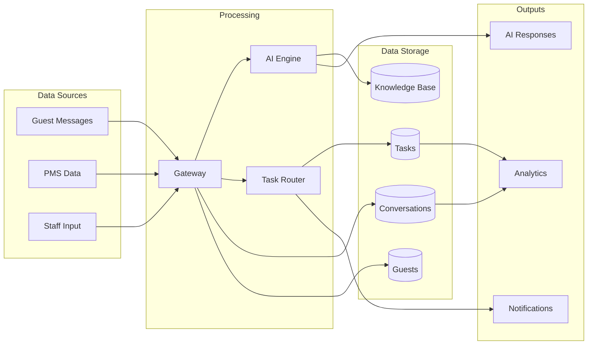

---

## Entity Relationship Diagram

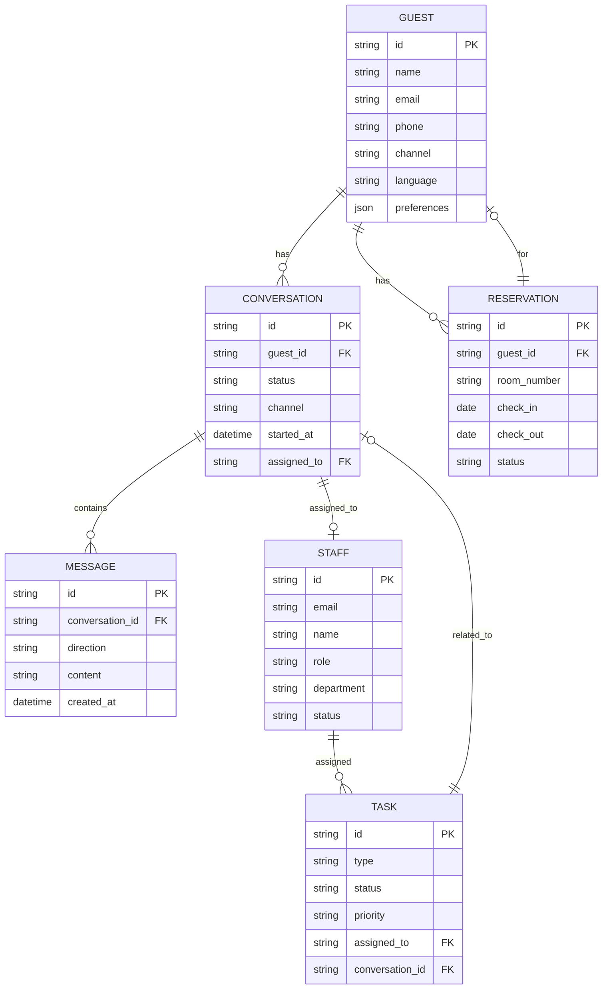

---

## Network Diagram

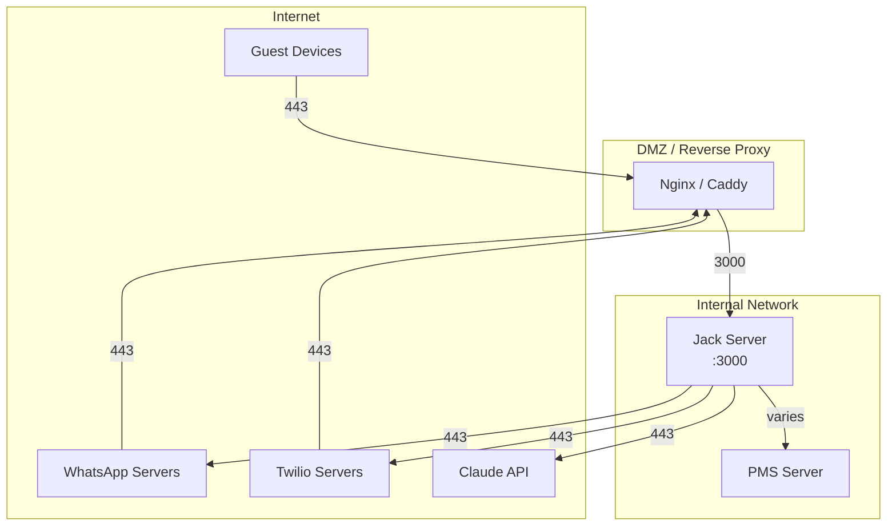

---

## Usage

These diagrams can be rendered using:

1. **GitHub/GitLab** - Native Mermaid support in markdown
2. **VS Code** - Mermaid extension
3. **Mermaid Live Editor** - https://mermaid.live
4. **Documentation tools** - Docusaurus, MkDocs with plugins

---

## Related

- [Architecture Overview](index.md) - Written architecture description
- [C4 Components](c4-components/) - Detailed component specifications
- [Tech Stack](tech-stack.md) - Technology choices
